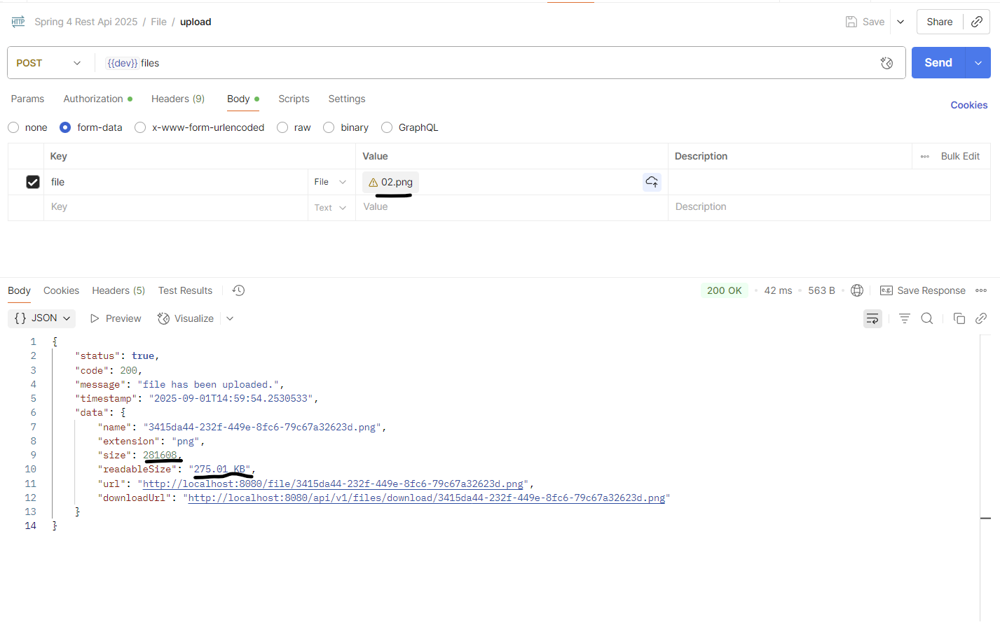
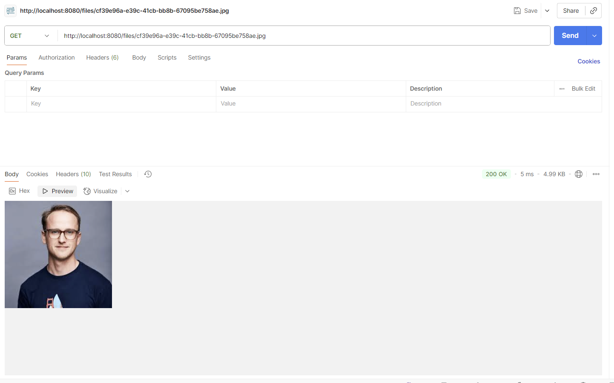
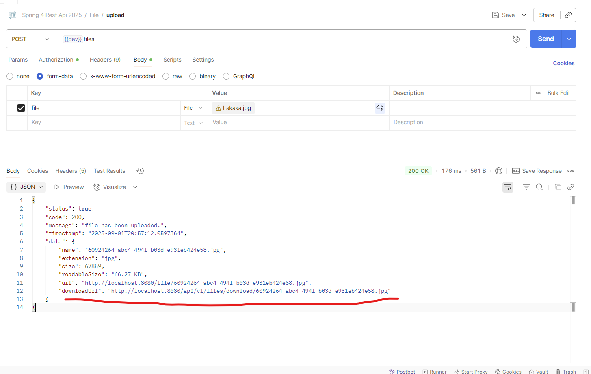
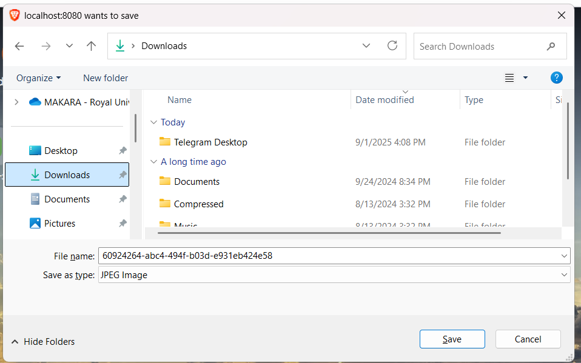
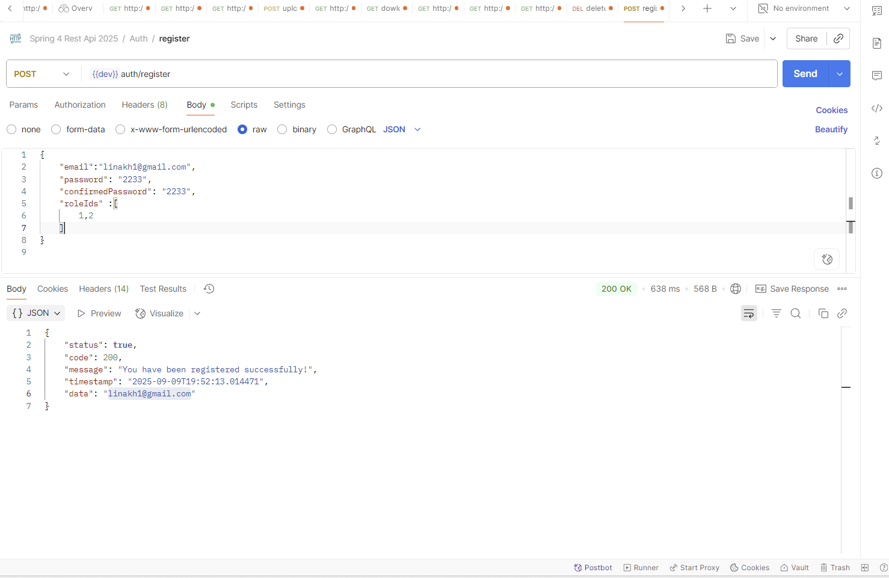
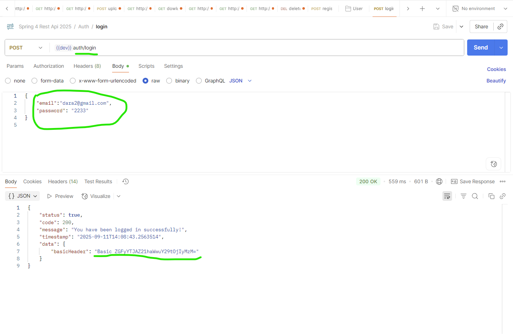
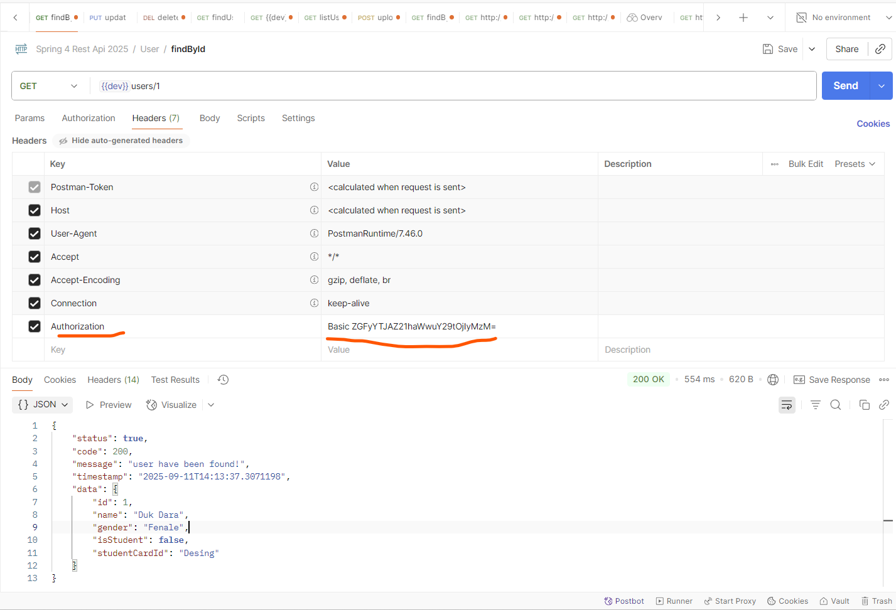

# Mobile Banking API 
# OverView

A secure and modular RESTful API for mobile banking, built with Spring Boot and MyBatis.
It supports customer registration, account management, and transaction processing — tailored
for integration with mobile apps and financial systems in Cambodia.

# Tech Stack 
  . Java JDK 17  
  . Spring boot 3x  
  . Spring Web  
  . MyBatis  
  . PostgreSQL  
  . Lombok  
  . Validation  
  . MapStruct (optional for DTO mapping)  
  
# Project Structure

src/  
├── main/ 
│   ├── java/com/bank/mobileapi/  
│   │   ├── controller/         # REST endpoints  
│   │   ├── service/            # Business logic  
│   │   ├── mapper/             # MyBatis mappers  
│   │   ├── model/              # Entities & DTOs  
│   │   ├── config/             # Security, Swagger, MyBatis  
│   │   └── MobileBankingApplication.java  
│   └── resources/   
│       ├── mapper/             # XML SQL mappings   
│       ├── application.yml     # Configurations     
│       └── static/   
└── test/  
└── java/com/bank/mobileapi/  

 # Feature Requirement
1. Account Type
   -Saving, Payroll, Credit, Debit
2. User
3. User Account
4. Transaction
   -Transfer
   - Payment(Mobile Topup, School Payment)
5. Notification(One Signal)
   application.dev(login group role)

# Setup instructions
1. Configure Database 

spring.datasource.driver-class-name=org.postgresql.Driver
spring.datasource.url=jdbc:postgresql://localhost:5432/spring-mbanking-api
spring.datasource.username=user-name
spring.datasource.password=password

2. Database Design 

3. Build and Run
  - ./gradlew.bat clean
  - ./gradlew.bat bootRun

# API Validation 
   1. Set up Constraint in DTO
   2. Validation DTO in Controller
   3. Handle Exception

# create save users
  # Api end point
  create : localhost:8080/api/v1/users 
  findId : localhost:8080/api/v1/users/1
  
# Api Exception

@RestControllerAdvice  
public class ApiException {

    //Exception catch to field errors in field detail.
    @ResponseStatus(HttpStatus.BAD_REQUEST)
    @ExceptionHandler(MethodArgumentNotValidException.class)
    public ErrorApi<?> handleValidationException(MethodArgumentNotValidException e){
        List<Map<String, String>> errors = new ArrayList<>();
        //using foreach
        for (FieldError fieldError : e.getFieldErrors()){
            Map<String, String> error = new HashMap<>();
            error.put("field", fieldError.getField());
            error.put("detail", fieldError.getDefaultMessage());
            errors.add(error);
        }
        return ErrorApi.builder()
                .status(false)
                .code(HttpStatus.BAD_REQUEST.value())
                .message("Something went wrong, please check in error detail!")
                .timestamp(LocalDateTime.now())
                .errors(errors)
                .build();
    }
    //exception update information
    @ResponseStatus(HttpStatus.INTERNAL_SERVER_ERROR)
    @ExceptionHandler(ResponseStatusException.class)
    public ErrorApi<?> handleServiceException(ResponseStatusException e){
        return ErrorApi.builder()
                .status(false)
                .code(e.getStatusCode().value())
                .message("Something went wrong, please check in error detail!")
                .timestamp(LocalDateTime.now())
                .errors(e.getReason())
                .build();
    }
}

# Mapstruct 
 * Definition 
   MapStruct is a Java annotation processor that generates code for mapping between different object models (like Entity ↔ DTO) at compile time.
   It’s widely used in Spring Boot projects to reduce boilerplate code when converting between entities, DTOs, and request/response objects.

  * Add dependency  
    implementation 'org.mapstruct:mapstruct:1.5.5.Final'
    annotationProcessor 'org.mapstruct:mapstruct-processor:1.5.5.Final'
  * 
# create Mapstruct  
@Mapper(componentModel = "spring")  
public interface UserMapstruct { 
User saveUserDtoToUser(SaveUserDto dto); 
UserDto userToUserDto(User user); 
}

# How to upload images to resource 
1. Step number 1
 - Configure application.properties or appliction.yml

   file.server-path = D:\\Self Study 2025\\Rest Api Mybatis\\Thumbnail\\  
   file.client-path = /files/**   
   file.base-url = http://localhost:8080/file/   
   file.download-url=http://localhost:8080/api/v1/files/download/  

2. Step number 2
   Create file Utils Using FileDto
- Design FileDto
  recode field (name, size , url, extension,downloadUrl)
- File Service
   get from MultipleFile 

  - create file util     
    @Component   
    public class FileUtil {   
    @Value("${file.base-url}")   
    private String fileBaseUrl;   

    @Value("${file.server-path}")   
    private String fileServerPath;   

    @Value("${file.download-url}")   
    private String fileDownload;   

    public FileDto upload(MultipartFile file){   
    String extension = getExtension(file.getOriginalFilename());  
    String name = String.format("%s.%s", UUID.randomUUID(),extension);  
    Long size = file.getSize();  
    String url = getUrl(name);  

         Path path = Paths.get(fileServerPath+name);
         try {
             Files.copy(file.getInputStream(),path);
         } catch (IOException e) {
           throw  new ResponseStatusException(
                   HttpStatus.INTERNAL_SERVER_ERROR,
                   e.getMessage());
         }
         return FileDto.builder()
                 .name(name)
                 .size(size)
                 .extension(extension)
                 .url(url)
                 .downloadUrl(fileDownload+ name)
                 .build();
    }
  
    public String getExtension(String name){  
           int dotLastIndex = name.lastIndexOf(".");   
    return name.substring(dotLastIndex+1);  
    }
      
    public String getUrl(String name){ 
    return fileBaseUrl + name; 
    }
      
    public String getDownloadUrl(String name){ 
    return fileDownload + name; 
    }
      
    public Resource load(String name) { 
    Path path = Paths.get(fileServerPath + name); 
    return UrlResource.from(path.toUri()); 
    }
      
    public void delete(String name) throws IOException {   
              Path path = Paths.get(fileServerPath + name);  
    Files.deleteIfExists(path);  
    }
      
  }
# Read able Size file 

# Find Name file Like the image  

# step download file  
 - upload image after successfully copy path downloadUrl by image below:  
  
 - Pass url to browser it's show image like this :  

 
 
# Security In memory
1. Add dependency
   implementation 'org.springframework.boot:spring-boot-starter-security'
2. Define bean FilterChain  

public class SecurityConfig {  
        //injection bean  
    private final PasswordEncoder passwordEncoder;

    //1. Define bean: security FilterChain . // update spring version3. like arrow function.
    @Bean
    public SecurityFilterChain securityFilterChain(HttpSecurity http) throws Exception{
        // Disable CSRF (for APIs)
        http.csrf(token -> token.disable());

        //Configure Http mapping URL.
        http.authorizeHttpRequests(auth -> auth
                .requestMatchers("/api/v1/users/**").hasRole("ADMIN")
                .requestMatchers(HttpMethod.GET,"/api/v1/account-types/**").hasRole("USER")
                .requestMatchers(HttpMethod.POST,"/api/v1/files/**").hasRole("EDITOR")
                .anyRequest().authenticated()
        );

        //Configure security mechanism
        http.httpBasic(httpBasic->{});

        // Make session stateless
        http.sessionManagement(session
                ->session.sessionCreationPolicy(SessionCreationPolicy.STATELESS));
        return http.build();
    }

3. Define In Memory  
@Bean  
public UserDetailsService userDetailsService(){ 

        UserDetails admin = User.builder()
                .username("makara")
                .password(passwordEncoder.encode("admin123"))
                .roles("ADMIN")
                .build();

        UserDetails editor = User.builder()
                .username("dara")
                .password(passwordEncoder.encode("123"))
                .roles("EDITOR")
                .build();

        return new InMemoryUserDetailsManager(user, admin, editor);
    }

}
# fetch api client request basic auth javaScript

 <!-- Client response  -->
    

# register 

- Noted : when you register new account we need to including roles 2 numbers because it is a list  

public record RegisterDto(

         @NotBlank(message = "Email is required")
         @Email(message = "Email should be valid")
         String email,

        @NotBlank(message = "Password is required")
        @Size(min = 4, message = "Password must be at least 8 characters")
        String password,

        @NotBlank(message = "Confirm password is required")
        String confirmedPassword,

        @NotNull
        List<Integer> roleIds
) {

}

# Annotation Transaction

Key Benefits of @Transactional in This Context:  
Atomicity: It wraps multiple database operations into a single "all-or-nothing" unit of work.

Consistency: It guarantees your application data remains consistent,
preventing orphaned records or half-baked user accounts.

Automatic Rollback: It automatically rolls back the transaction if a runtime exception is thrown.
You don't have to write manual rollback logic.

Simplified Code: You write your business logic as if everything will work,
and Spring handles the complex transaction management behind the scenes.

# Login data transfer object for access basic authorization like following base64 authentication

- Step 1 :
 create AuthDto

public record AuthDto(String basicHeader) {

}

step 2 : create AuthService

public interface AuthService {

  AuthDto login(LoginDto loginDto);

}

step 3 : implement Service

    @Override
    public AuthDto login(LoginDto loginDto) {

        Authentication auth = new UsernamePasswordAuthenticationToken(
            loginDto.email(),
            loginDto.password()
            );
            auth = authProvider.authenticate(auth);

        CustomUserDetails customUserDetails = (CustomUserDetails) auth.getPrincipal();

        log.info("Auth :{}", customUserDetails.getUser().getEmail());
        //create following algorithm and RSA keys.
        String basicAuthString = auth.getName() + ":"+ auth.getCredentials();
        String basicAuthHeader = Base64.getEncoder().encodeToString(basicAuthString.getBytes());

        return new AuthDto(String.format("Basic %s",basicAuthHeader));
    }

step 4 : Call service to AuthController 

    @PostMapping("/login")
    public BaseApi<?> login(@RequestBody LoginDto loginDto){

        AuthDto authDto = authService.login(loginDto);

        return BaseApi.builder()
                .status(true)
                .code(HttpStatus.OK.value())
                .message("You have been logged in successfully!")
                .timestamp(LocalDateTime.now())
                .data(authDto)
                .build();
    }

# I just drop the image for Login access basic authorization access resource

# Copy basic auth to resource for access like below the image :

