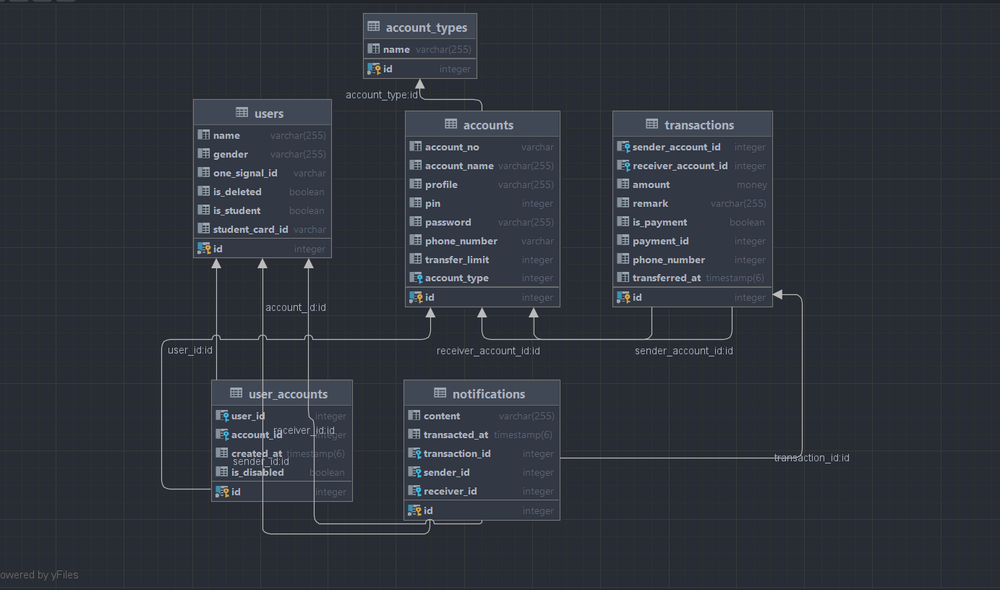

# Mobile Banking API 
# OverView

A secure and modular RESTful API for mobile banking, built with Spring Boot and MyBatis.
It supports customer registration, account management, and transaction processing — tailored
for integration with mobile apps and financial systems in Cambodia.

# Tech Stack 
  . Java JDK 17  
  . Spring boot 3x  
  . Spring Web  
  . MyBatis  
  . PostgreSQL  
  . Lombok  
  . Validation  
  . MapStruct (optional for DTO mapping)  
  
# Project Structure

src/  
├── main/ 
│   ├── java/com/bank/mobileapi/  
│   │   ├── controller/         # REST endpoints  
│   │   ├── service/            # Business logic  
│   │   ├── mapper/             # MyBatis mappers  
│   │   ├── model/              # Entities & DTOs  
│   │   ├── config/             # Security, Swagger, MyBatis  
│   │   └── MobileBankingApplication.java  
│   └── resources/   
│       ├── mapper/             # XML SQL mappings   
│       ├── application.yml     # Configurations     
│       └── static/   
└── test/  
└── java/com/bank/mobileapi/  

 # Feature Requirement
1. Account Type
   -Saving, Payroll, Credit, Debit
2. User
3. User Account
4. Transaction
   -Transfer
   - Payment(Mobile Topup, School Payment)
5. Notification(One Signal)
   application.dev(login group role)

# Setup instructions
1. Configure Database 

spring.datasource.driver-class-name=org.postgresql.Driver
spring.datasource.url=jdbc:postgresql://localhost:5432/spring-mbanking-api
spring.datasource.username=user-name
spring.datasource.password=password

2. Database Design 

3. Build and Run
  - ./gradlew.bat clean
  - ./gradlew.bat bootRun

# API Validation 
   1. Set up Constraint in DTO
   2. Validation DTO in Controller
   3. Handle Exception